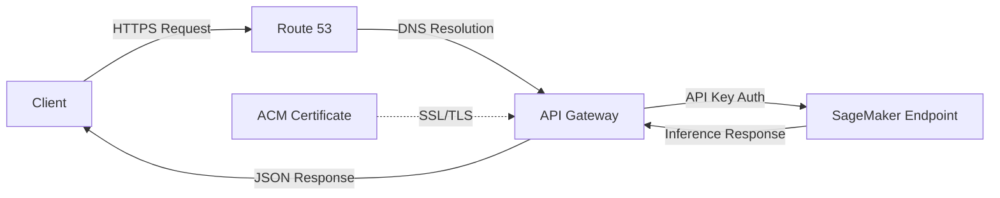

# AWS SageMaker Hugging Face Model Deployment Templates

Deploy production-ready Hugging Face models on AWS SageMaker with custom HTTPS endpoints using CloudFormation. These templates automatically provision SageMaker endpoints, API Gateway with API key authentication, SSL certificates, and custom domain routing via Route 53.

## Overview

This repository contains AWS CloudFormation templates for deploying 10 different Hugging Face models to AWS SageMaker. Each deployment includes:

- **SageMaker Model & Endpoint**: Hosts the ML model for inference
- **API Gateway REST API**: Provides secure REST API with API key authentication and usage plans
- **ACM Certificate**: Auto-provisioned SSL certificate for HTTPS
- **Route 53 DNS Record**: Custom domain pointing to your API endpoint
- **IAM Roles**: Properly scoped execution roles for SageMaker and API Gateway

## Architecture



## Available Models

| Model | Template File | Use Case | Deployment Type | Instance Type | HF Token Required |
|-------|---------------|----------|-----------------|---------------|-------------------|
| BERT Base Uncased | `bert-base-uncased.yaml` | Fill-mask / MLM | Standard | ml.c5.xlarge | No |
| Emotion RoBERTa | `emotion-english-distilroberta-base.yaml` | Emotion classification | Standard | ml.t2.medium | No |
| Twitter RoBERTa Sentiment | `twitter-roberta-base-sentiment-latest.yaml` | Sentiment analysis | Standard | ml.t2.medium | No |
| Twitter RoBERTa Hate Speech | `twitter-roberta-base-hate-latest.yaml` | Hate speech detection | Standard | ml.t2.medium | No |
| CLIP ViT-B/32 | `clip-ViT-B-32.yaml` | Zero-shot image classification | Standard | ml.t2.medium | No |
| Llama 3.2-3B Instruct | `llama-3-2-3b.yaml` | Text generation | Standard (GPU) | ml.g5.2xlarge | **Yes** |
| Gemma 3-4B IT | `gemma-3-4b-it.yaml` | Text generation | Standard (GPU) | ml.g6.xlarge | **Yes** |

## Prerequisites

### Required: AWS Account & CLI

- AWS account with permissions for:
  - SageMaker (full access)
  - API Gateway (create and manage APIs)
  - Route 53 (manage DNS records)
  - ACM (request and manage certificates)
  - IAM (create roles)
  - CloudFormation (create and manage stacks)

### Required: Route 53 Hosted Zone

**What is it?** A Route 53 Hosted Zone is a DNS configuration for your domain that allows AWS to manage DNS records.

**Why required?** These templates create custom HTTPS endpoints (e.g., `bert.yourdomain.com`, `llama.yourdomain.com`) that require DNS configuration and SSL certificates.

**How to set up:**
1. Own a domain (from any registrar: Route 53, GoDaddy, Namecheap, etc.)
2. Create a Hosted Zone in Route 53:
   - Go to AWS Console → Route 53 → Hosted Zones → Create Hosted Zone
   - Enter your domain name
   - Note the Hosted Zone ID (format: `Z############`)
3. Update your domain's nameservers to point to the Route 53 NS records

**Documentation:** [Working with Hosted Zones](https://docs.aws.amazon.com/Route53/latest/DeveloperGuide/hosted-zones-working-with.html)

### Required for Some Models: Hugging Face Token

**Required for:** Llama 3.2-3B, Gemma 3-4B (all variants)

**Why?** These are gated models that require authentication to access.

**How to obtain:**
1. Create a free account at [huggingface.co](https://huggingface.co)
2. Accept the model license agreement on the model page:
   - [Llama 3.2-3B](https://huggingface.co/meta-llama/Llama-3.2-3B-Instruct)
   - [Gemma 3-4B](https://huggingface.co/google/gemma-3-4b-it)
3. Generate a token at [huggingface.co/settings/tokens](https://huggingface.co/settings/tokens)
   - Select "Read" access (sufficient for model downloads)

## Quick Start

### Step 1: Clone Repository

```bash
git clone <repository-url>
cd <repository-name>
```

### Step 2: Choose Your Model

Review the [Available Models](#available-models) table above to select a model that fits your use case.

### Step 3: Customize Parameters

> **⚠️ CRITICAL:** The parameter files in `parameters/` contain example values that **MUST be modified** before deployment!

Navigate to the corresponding parameter file in `parameters/` directory and update the following:

#### Required Parameter Updates

| Parameter | Example Value | What to Change |
|-----------|---------------|----------------|
| `RootDomain` | Replace with **your actual domain** |
| `HostedZoneId` Replace with **your Route 53 Hosted Zone ID** |
| `SubdomainPrefix` | `bert`, `llama3`, etc. | Choose your desired subdomain |
| `HfToken` | `hf_YOUR_TOKEN_HERE` | **(Llama/Gemma only)** Replace with your actual Hugging Face token |
| `Project` | `MLProject` | Your project name for cost tracking |

#### Optional Parameter Customizations

| Parameter | Default | Description |
|-----------|---------|-------------|
| `shortcode` | `""` | Cost allocation tag (we use this for billing in our environment) |
| `InstanceType` | Varies | Change instance size based on performance needs |
| `InitialInstanceCount` | `1` | Number of instances (for standard endpoints) |
| `ApiKeyRateLimit` | `20` | API rate limit (requests per second) |
| `ApiKeyBurstLimit` | `5` | API burst capacity |
| `ApiKeyMonthlyQuota` | `10000` | Monthly request quota |
| `ServerlessMemorySize` | `2048` or `6144` | Memory for serverless endpoints (1024-6144 MB) |
| `ServerlessMaxConcurrency` | `5` or `2` | Max concurrent invocations (serverless only) |

**Example parameter file edit:**

```json
{
  "ParameterKey": "RootDomain",
  "ParameterValue": "example.com"  // Change to your domain
},
{
  "ParameterKey": "HostedZoneId",
  "ParameterValue": "XXXXXXXXXXX"  // Change to your hosted zone ID
},
{
  "ParameterKey": "HfToken",
  "ParameterValue": "hf_aBcDeFgHiJkLmNoPqRsTuVwXyZ123456"  // YOUR actual token
}
```

> **🔒 SECURITY WARNING:** Never commit your Hugging Face token to version control! Consider using AWS Secrets Manager or environment variables for production deployments.

### Step 4: Deploy the Stack

```bash
cd templates

aws cloudformation create-stack \
  --stack-name your-model-stack \
  --template-body file://your-chosen-template.yaml \
  --parameters file://parameters/YourParameters.json \
  --capabilities CAPABILITY_NAMED_IAM \
  --region us-east-1
```

**Example for Llama:**
```bash
aws cloudformation create-stack \
  --stack-name llama-3-2-3b-stack \
  --template-body file://llama-3-2-3b.yaml \
  --parameters file://parameters/Llama323B.json \
  --capabilities CAPABILITY_NAMED_IAM \
  --region us-east-1
```

### Step 5: Monitor Deployment

```bash
aws cloudformation describe-stacks \
  --stack-name your-model-stack \
  --region us-east-1 \
  --query 'Stacks[0].StackStatus'
```

**Expected deployment times:**
- Standard endpoints: 10-20 minutes


Watch for status `CREATE_COMPLETE`. If you see `CREATE_FAILED`, check the Events tab in AWS Console for error details.

## Post-Deployment

### Getting Your API Key

After deployment completes, retrieve your API key:

```bash
# List all API keys with values
aws apigateway get-api-keys --include-values --region us-east-1

# Or filter by your model name
aws apigateway get-api-keys \
  --name-query BERTBaseUncased-ApiKey \
  --include-values \
  --region us-east-1
```

Look for the `value` field in the response - this is your API key.

### Getting Your Endpoint URL

Check CloudFormation outputs for the endpoint URL:

```bash
aws cloudformation describe-stacks \
  --stack-name your-model-stack \
  --query 'Stacks[0].Outputs' \
  --region us-east-1
```

The output will show `EndpointURL`, typically in format: `https://subdomain.yourdomain.com/prod/predict`

## Testing Your Endpoint

Once deployed, test your endpoint using curl or any HTTP client:

### Text Classification (Emotion, Sentiment, Hate Speech)

```bash
curl -X POST https://emotion.yourdomain.com/prod/predict \
  -H "Content-Type: application/json" \
  -H "x-api-key: YOUR_API_KEY_HERE" \
  -d '{
    "inputs": "I absolutely love this product! It works great."
  }'
```

**Expected response:**
```json
[
  [
    {"label": "joy", "score": 0.9345},
    {"label": "surprise", "score": 0.0321},
    {"label": "neutral", "score": 0.0234}
  ]
]
```

### Fill-Mask (BERT)

```bash
curl -X POST https://bert.yourdomain.com/prod/predict \
  -H "Content-Type: application/json" \
  -H "x-api-key: YOUR_API_KEY_HERE" \
  -d '{
    "inputs": "The capital of France is [MASK]."
  }'
```

**Expected response:**
```json
[
  {
    "score": 0.9876,
    "token": 3000,
    "token_str": "paris",
    "sequence": "the capital of france is paris."
  },
  ...
]
```

### Text Generation (Llama, Gemma)

```bash
curl -X POST https://llama.yourdomain.com/prod/predict \
  -H "Content-Type: application/json" \
  -H "x-api-key: YOUR_API_KEY_HERE" \
  -d '{
    "inputs": "Write a haiku about artificial intelligence:",
    "parameters": {
      "max_new_tokens": 50,
      "temperature": 0.7,
      "top_p": 0.9
    }
  }'
```

**Expected response:**
```json
[
  {
    "generated_text": "Write a haiku about artificial intelligence:\n\nSilicon neurons think\nPatterns emerge from the void\nMachines learn to dream"
  }
]
```

### Zero-Shot Image Classification (CLIP)

```bash
# First, encode your image to base64
IMAGE_BASE64=$(base64 -i your-image.jpg)

curl -X POST https://clip.yourdomain.com/prod/predict \
  -H "Content-Type: application/json" \
  -H "x-api-key: YOUR_API_KEY_HERE" \
  -d "{
    \"inputs\": \"$IMAGE_BASE64\",
    \"parameters\": {
      \"candidate_labels\": [\"cat\", \"dog\", \"bird\", \"car\"]
    }
  }"
```

**Expected response:**
```json
[
  {"label": "cat", "score": 0.9234},
  {"label": "dog", "score": 0.0543},
  {"label": "bird", "score": 0.0123},
  {"label": "car", "score": 0.0100}
]
```

## Cost Considerations

### Standard Endpoints (Always-On Instances)

**Pricing:**
- Charged per hour while endpoint is running (even when idle)
- Instance costs vary by type:
  - `ml.t2.medium`: ~$0.065/hour (~$47/month if running 24/7)
  - `ml.c5.xlarge`: ~$0.204/hour (~$147/month if running 24/7)
  - `ml.g5.2xlarge` (GPU): ~$1.52/hour (~$1,094/month if running 24/7)
  - `ml.g6.xlarge` (GPU): ~$1.10/hour (~$792/month if running 24/7)

**Best for:**
- Production workloads with consistent traffic
- Low-latency requirements (no cold starts)
- Predictable usage patterns

### Serverless Endpoints (Pay-Per-Use)

**Pricing:**
- Scale to zero when idle (no charges when not in use)
- Charged per invocation + compute duration
- Typical cost: $0.20 per compute-hour + $0.0000002 per request

**Trade-offs:**
- **Pros:** No cost when idle, automatic scaling, no instance management
- **Cons:** Cold start latency (10-15 seconds for first request after idle period)

**Best for:**
- Development and testing
- Sporadic or unpredictable workloads
- Cost optimization for low-traffic endpoints

### Additional Costs

| Service | Cost |
|---------|------|
| API Gateway | $3.50 per million requests |
| Route 53 Hosted Zone | $0.50/month |
| ACM Certificate | Free |
| Data Transfer (Outbound) | $0.09/GB (first 10 TB) |
| CloudWatch Logs | $0.50/GB ingested |

### Cost Optimization Tips

1. **Delete unused endpoints:** Don't leave test endpoints running overnight
2. **Use serverless for dev/test:** Save costs during development
3. **Monitor with CloudWatch:** Set up billing alerts for unexpected charges
4. **Right-size instances:** Start small and scale up based on actual performance needs
5. **Use spot instances:** (Advanced) Can reduce costs by 70% for fault-tolerant workloads

**Example monthly cost breakdown (BERT on ml.t2.medium):**
```
SageMaker endpoint:    $47.00  (ml.t2.medium 24/7)
API Gateway:           $3.50   (1M requests)
Route 53:              $0.50   (hosted zone)
Data Transfer:         ~$9.00  (100GB outbound)
-----------------------------------------
Total:                 ~$60/month
```

## Troubleshooting

### 1. Certificate Validation Stuck

**Problem:** ACM certificate stays in "Pending Validation" status indefinitely.

**Cause:** DNS records not properly configured in Route 53.

**Solution:**
- Verify `HostedZoneId` parameter matches your domain's hosted zone
- Ensure your domain's nameservers point to Route 53 NS records
- DNS propagation can take 30-60 minutes - be patient
- Check Route 53 console for the validation CNAME record

### 2. Stack Creation Failed: IAM Permissions

**Problem:** CloudFormation fails with permission denied errors.

**Cause:** AWS user/role lacks required permissions.

**Solution:**
- Ensure your IAM user has these managed policies:
  - `AmazonSageMakerFullAccess`
  - `AmazonAPIGatewayAdministrator`
  - `AmazonRoute53FullAccess`
  - `AWSCertificateManagerFullAccess`
  - `IAMFullAccess` (or custom policy to create roles)
  - `AWSCloudFormationFullAccess`

### 3. Invalid Hosted Zone ID

**Problem:** Stack creation fails with "Invalid Hosted Zone ID" error.

**Cause:** Wrong Hosted Zone ID in parameter file.

**Solution:**
- Get correct ID from Route 53 console: Route 53 → Hosted Zones
- Format should be: `Z` followed by alphanumeric characters (e.g., `Z0123456789ABC`)
- Ensure the hosted zone is for the correct domain matching `RootDomain` parameter

### 4. Model Download Failed (Llama/Gemma)

**Problem:** SageMaker endpoint fails to initialize with model download error.

**Cause:** Invalid, expired, or missing Hugging Face token, or license not accepted.

**Solution:**
1. Verify token is valid at [huggingface.co/settings/tokens](https://huggingface.co/settings/tokens)
2. Ensure you've accepted the model license agreement on Hugging Face:
   - Visit the model page (e.g., meta-llama/Llama-3.2-3B-Instruct)
   - Click "Agree and access repository"
3. Check token has "Read" permissions
4. Update parameter file with correct token and redeploy

### 5. API Returns 403 Forbidden

**Problem:** API requests return 403 status code.

**Cause:** Missing or invalid API key.

**Solution:**
- Ensure you're including the `x-api-key` header (not `Authorization`)
- Verify API key value from AWS Console or CLI
- Check API key is enabled in API Gateway console
- Verify API key is associated with the usage plan

### 6. Endpoint Returns 5XX Error

**Problem:** Endpoint deployed successfully but returns 500/503 errors.

**Cause:** Model loading failed, insufficient resources, or model compatibility issues.

**Solution:**
1. Check SageMaker endpoint logs in CloudWatch:
   ```bash
   aws logs tail /aws/sagemaker/Endpoints/your-endpoint-name --follow --region us-east-1
   ```
2. Common issues:
   - Insufficient memory for model (try larger instance or serverless memory)
   - Wrong container image for model type
   - Model requires GPU but deployed on CPU instance
3. Try deleting and recreating the endpoint with different configuration

### 7. DNS Not Resolving

**Problem:** Custom domain doesn't resolve after deployment.

**Cause:** DNS propagation delay or incorrect Route 53 configuration.

**Solution:**
- Wait 5-15 minutes for DNS propagation
- Verify A record exists in Route 53 hosted zone
- Test with `dig` or `nslookup`:
  ```bash
  dig bert.yourdomain.com
  ```
- Ensure nameservers are correctly configured at your domain registrar

### 8. High Costs / Unexpected Charges

**Problem:** AWS bill is higher than expected.

**Cause:** Endpoints left running, high traffic, or data transfer costs.

**Solution:**
1. Check running endpoints:
   ```bash
   aws sagemaker list-endpoints --region us-east-1
   ```
2. Delete unused stacks (see [Cleanup](#cleanup) section)
3. Set up billing alerts in AWS Billing console
4. Review CloudWatch metrics for request volume
5. Consider switching to serverless for low-traffic endpoints

## Updating an Endpoint

To modify an existing deployment (e.g., change instance type, update model, adjust rate limits):

```bash
aws cloudformation update-stack \
  --stack-name your-model-stack \
  --template-body file://your-template.yaml \
  --parameters file://parameters/YourParameters.json \
  --capabilities CAPABILITY_NAMED_IAM \
  --region us-east-1
```

**⚠️ Note:** Updating endpoint configuration causes a brief downtime during resource replacement. Plan updates during maintenance windows.

## Cleanup

### Deleting a Stack

When you no longer need an endpoint, delete the entire stack to avoid ongoing charges:

```bash
aws cloudformation delete-stack \
  --stack-name your-model-stack \
  --region us-east-1
```

### Monitor Deletion Progress

```bash
aws cloudformation describe-stacks \
  --stack-name your-model-stack \
  --region us-east-1 \
  --query 'Stacks[0].StackStatus'
```

Wait for status `DELETE_COMPLETE` (typically 5-10 minutes).

### What Gets Deleted

CloudFormation will automatically remove:
- ✅ SageMaker endpoint, endpoint config, and model
- ✅ API Gateway REST API, stages, and custom domain
- ✅ ACM SSL certificate
- ✅ Route 53 A record for the subdomain
- ✅ IAM roles created by the template

### What Persists (Manual Cleanup Required)

These resources are NOT deleted and may incur costs:
- ⚠️ Route 53 Hosted Zone ($0.50/month)
- ⚠️ CloudWatch Logs (if log retention configured)
- ⚠️ API Gateway usage plan metrics and historical data

To delete CloudWatch logs:
```bash
aws logs delete-log-group \
  --log-group-name /aws/sagemaker/Endpoints/your-endpoint-name \
  --region us-east-1
```

## Additional Resources

- **AWS SageMaker Documentation:** [docs.aws.amazon.com/sagemaker](https://docs.aws.amazon.com/sagemaker/)
- **Hugging Face on SageMaker:** [huggingface.co/docs/sagemaker](https://huggingface.co/docs/sagemaker/)
- **API Gateway Best Practices:** [docs.aws.amazon.com/apigateway](https://docs.aws.amazon.com/apigateway/)
- **CloudFormation User Guide:** [docs.aws.amazon.com/cloudformation](https://docs.aws.amazon.com/cloudformation/)
- **Route 53 Developer Guide:** [docs.aws.amazon.com/route53](https://docs.aws.amazon.com/route53/)
- **AWS Pricing Calculator:** [calculator.aws](https://calculator.aws/)

## Contributing

Contributions are welcome! Please open an issue or submit a pull request for:
- Bug fixes
- New model templates
- Documentation improvements
- Cost optimization suggestions

## License

This project is provided as-is for educational and commercial use. Individual Hugging Face models have their own licenses - please review the license for each model on Hugging Face before deployment:

- [BERT License](https://huggingface.co/google-bert/bert-base-uncased)
- [RoBERTa License](https://huggingface.co/cardiffnlp/twitter-roberta-base-sentiment-latest)
- [CLIP License](https://huggingface.co/openai/clip-vit-base-patch32)
- [Llama 3.2 License](https://huggingface.co/meta-llama/Llama-3.2-3B-Instruct)
- [Gemma License](https://huggingface.co/google/gemma-3-4b-it)

## Support

For issues related to:
- **Templates:** Open an issue in this repository
- **AWS Services:** Contact AWS Support or check AWS forums
- **Hugging Face Models:** Visit [Hugging Face forums](https://discuss.huggingface.co/)
- **Model-specific questions:** Check the model card on Hugging Face

---

**Note:** These templates are designed for us-east-1 region. To deploy in other regions, update the `SageMakerImageUri` parameter with the appropriate regional ECR image URI and specify `--region` in all AWS CLI commands.
